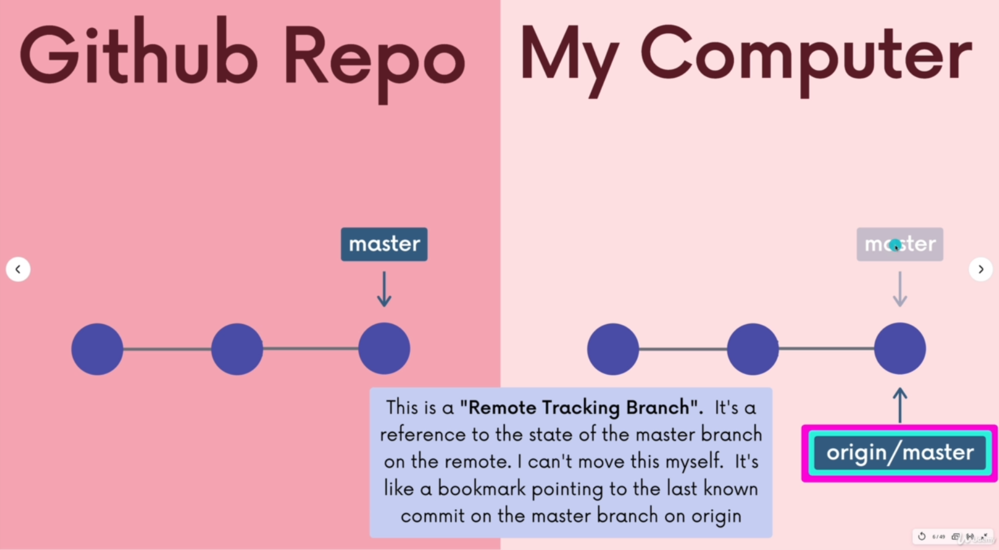
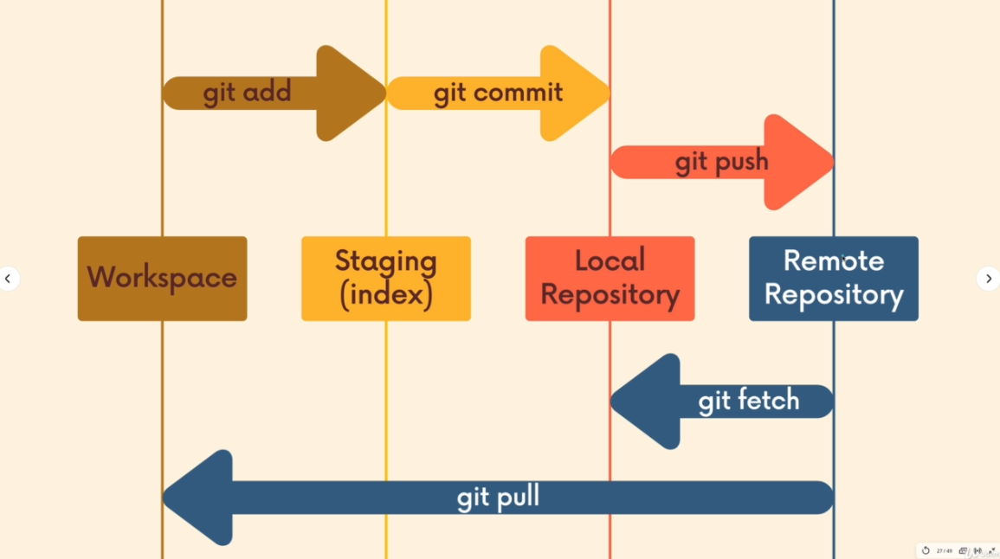

## GitHub Notes

### Branches



When working with Git and GitHub, we deal with two kinds of pointers:

* **Local pointer**: points to the current position (commit) in your local repository.
* **Remote tracking pointer**: stores the position of the branch on the remote repository (like GitHub) from the last time you fetched or pulled.

For example:

* `main` → your local branch
* `origin/main` → the branch state on GitHub the last time you fetched or pulled.

You can view the remote branches with:

```bash
git branch -r
```

When you **clone** a repository, you typically only see the `main` branch locally. To view and check out other remote branches, use `git branch -r` and then check them out with a **detached HEAD** (meaning you’re not on a branch, just at a specific commit).

If you want to properly work with them, you should **switch** to those branches or create a new local branch based on them.

---

### Fetch vs Pull



**Fetch** and **Pull** are two different ways to get updates from the remote repository:

* `git fetch` downloads new commits from the remote repository but does **not** update your working directory or current branch.
  It only updates the remote tracking branches (like `origin/main`).

```bash
git fetch <remote> <branch>
# Example
git fetch origin
# Default fetches all branches from 'origin'
git fetch
```

**Important:**
After a fetch, your local branch (like `main`) still points to the same commit.
Only the remote tracking branch (like `origin/main`) is updated.

* `git pull` is essentially:

> git fetch + git merge


It first fetches the changes from the remote, and then **automatically merges them into your current local branch**.

```bash
git pull <remote> <branch>
# Pulls and merges the specified branch from remote into your current branch

# Example:
git pull
# Equivalent to pulling from the branch you're currently tracking
```

> ⚠️ **Important:**
> Always make sure to `git pull` before pushing your changes to avoid conflicts.
> **Do not run `git pull` if you have uncommitted changes** — this can cause merge conflicts or disrupt your working directory.

## Summary

* Use `git fetch` when you want to see what has changed remotely without affecting your local code.
* Use `git pull` when you want to update your local branch with the latest changes from the remote.

