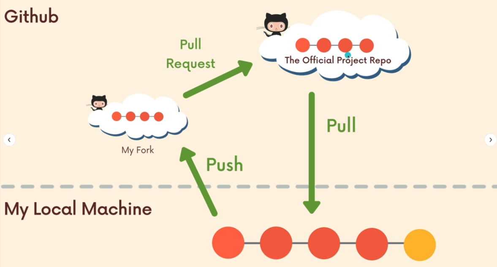

# GitHub Workflow

## Centralized Workflow

In a **centralized workflow**, everyone works on a single branch (usually `main` or `master`).

This is the simplest workflow but comes with some drawbacks:

* A higher chance of merge conflicts.
* If someone pushes broken code, it affects the entire project.
* If you need help with a problem, you'd have to push your incomplete or broken code to the shared branch, potentially disrupting others.

## Feature Branch Workflow

In this workflow, **all development is done in separate branches**.

Key points:

* `main` (or `master`) acts as the official project history.
* The `main` branch should always be in a deployable and stable state.
* Development happens in feature branches that are created for specific features, fixes, or experiments.

> ⚠️ Not all branches need to be pushed to GitHub.
> Often, you’ll work on a feature branch locally, merge it into `main` when it’s ready, and then delete the branch. Many companies also delete merged feature branches to keep the remote clean.

---

### Pull Requests (PR)

A **Pull Request (PR)** is a feature of **GitHub**, not Git itself.
You can’t directly merge branches into `main` through GitHub without a PR if protections are in place.

When you push a new branch to GitHub, it will suggest creating a PR at the top of the repository page. PRs can be made from any branch to any other branch (though usually from a feature branch into `main`).

Inside the PR:

* You can mention people using `@username`.
* Reviewers can comment, approve, or request changes.
* You can view and resolve conflicts before merging.

**Best practice for resolving conflicts:**

1. Merge the latest `main` branch into your feature branch locally.
2. Resolve any conflicts.
3. Push the updated feature branch.
4. Complete the PR to merge the clean, updated branch into `main`.

After the PR is merged, it's best to **delete the feature branch** to keep the repo clean.

---

### Branch Protection

You can protect critical branches like `main` to control how changes get merged.

**To set up:**
Go to `Settings > Branches` in your repository and configure branch protection rules.

You can:

* Require PR reviews before merging.
* Disallow direct pushes to `main`.
* Enforce status checks.
* And more.

## Fork & Clone Workflow

In large open-source projects, not everyone is granted direct collaborator permissions.
Instead, contributors **fork** the repository — creating a personal copy under their GitHub account — and make changes there.

**This is a GitHub feature, not a Git command.**

After making changes in the fork:

1. Push them to your forked repo.
2. Create a Pull Request from your fork to the original repository.

### Keeping Your Fork Updated

Since the original repository continues to evolve, you'll want to keep your fork in sync.
To do this, you can add a second remote called `upstream` pointing to the original repository.

```bash
# Add the original repository as a remote named 'upstream'
git remote add upstream <original-repo-url>

# Fetch the latest changes from 'main' branch of the original repo
git pull upstream main
```

This way, you can pull the latest updates even if you don’t have push access.




