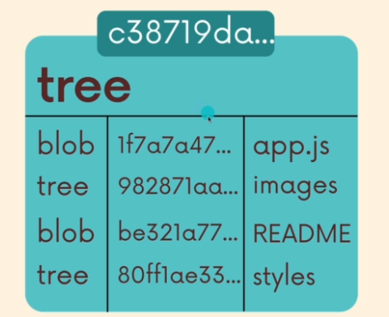

# 📁 Git Behind the Scenes (`.git` Directory)

When you create a Git repository, a hidden `.git` folder is created inside it. This folder contains all the information Git needs to track changes, branches, and commits.

## config

Contains the settings for the repository, like the username and email for commits.

```bash
# Set config globally (for all repos)
git config --global user.name "<name>"

# Set config locally (for this repo only)
git config --local user.name "<name>"

# See the config value
git config user.name
```

## refs (References)

In the `.git/refs/heads` directory, Git creates a file for each branch.
Each file is named after its branch and contains the hash of the latest commit (the "tip" of that branch).

This is how Git keeps track of where each branch is pointing.

**There are also folders for:**

* `refs/remotes` — for remote branches
* `refs/tags` — for tags

## HEAD

A plain text file that points to the current branch's reference file in `refs/heads/`.

It usually points to a branch, like:

```
ref: refs/heads/main
```

But if you’re in **detached HEAD state** (like when checking out a specific commit), it points directly to a commit hash instead.

## objects

This is where Git stores everything in your repository including:

* Commits
* Trees (directory listings)
* Blobs (file contents)
* Annotated tags

These files are compressed, hashed, and stored by their `SHA-1` checksum.
Git essentially works as a **key-value data store**, where the keys are SHA-1 hashes.

### The 4 Types of Git Objects:

| Type              | Purpose                                                                             |
| :---------------- | :---------------------------------------------------------------------------------- |
| **commit**        | Contains metadata about a commit and points to a tree object.                       |
| **tree**          | Represents the contents of a directory; contains pointers to blobs and other trees. |
| **blob**          | Stores file contents (without the filename).                                        |
| **annotated tag** | Points to a specific commit and contains extra metadata.                            |

### Inspecting Objects:

```bash
# See the type of an object
git cat-file -t <hash>

# See the content of an object
git cat-file -p <hash>

# Example: View the tree object at the tip of the master branch
git cat-file -p master^{tree}
```

### How Git Detects Changes:

Git generates a SHA-1 hash for the contents of each file it tracks.
When checking for changes, it hashes the file again and compares the result.
If the hash has changed, Git knows the file was modified.

### How Commits Work:

When you run `git commit`:

1. Git creates a new **commit object**
2. This commit’s **parent** is the current `HEAD` commit
3. It creates a **tree object** representing the current state (snapshot) of your working directory
4. That tree includes references to the files (blobs) and any subdirectories (other trees)

This is how Git tracks what files existed at a specific point in time.

<p align="center">
  
  
</p>
